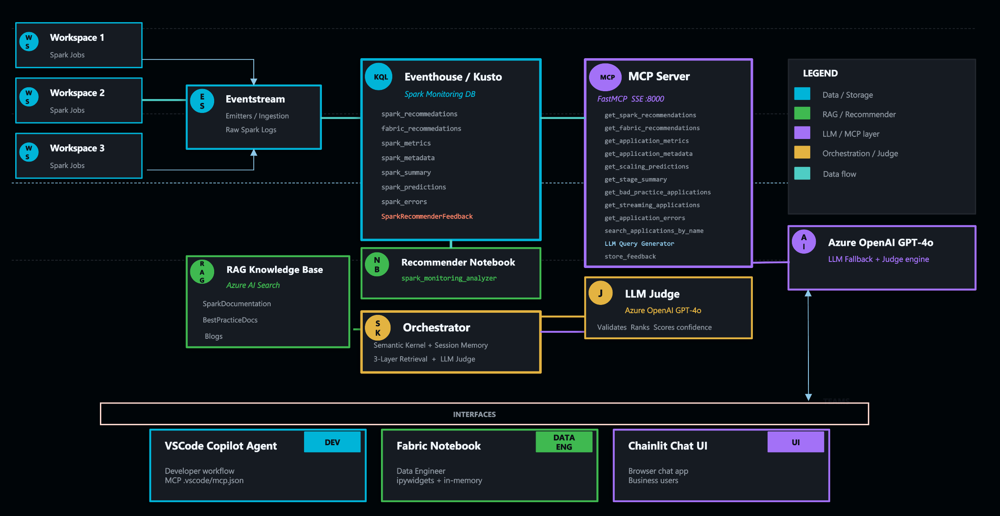

# ⚡ Fabric Spark Advisor (FSA)

[](https://www.python.org/downloads/)
[]()
[](https://opensource.org/licenses/MIT)
[](https://azure.microsoft.com/en-us/products/ai-services/openai-service)
[](https://www.microsoft.com/en-us/microsoft-fabric)

AI-powered Apache Spark optimization assistant for Microsoft Fabric, powered by:
- **MCP (Model Context Protocol)** for tool integration
- **Azure OpenAI GPT-4o** for intelligent recommendations
- **Azure AI Search** for RAG documentation retrieval
- **Azure Kusto** for telemetry analysis
- **Semantic Kernel** for agent orchestration
- **Chainlit** for interactive chat UI

---

## 🎥 Demo

> **📹 [Click here to download and watch the demo video](https://github.com/anuyogamlab/Fabric-Spark-Advisor/raw/main/assets/demo.mp4)** (53MB MP4)

**Fabric Spark Advisor in action** — Analyzing Spark applications, retrieving recommendations from Kusto, and providing actionable optimization guidance through conversational AI.

**Demo Highlights:**
- 💬 Natural language queries for Spark analysis
- 📊 Real-time Kusto data retrieval and visualization
- 🤖 AI-powered recommendation validation with confidence scoring
- ✅ Interactive feedback collection
- 🎨 Professional UI with collapsible sections and rich formatting

---

## ✨ Key Features

- 🎯 **Evidence-First Analysis** — Kusto data always shown verbatim, never modified or re-scored
- 🔍 **SparkLens Integration** — Deep Spark execution analysis with performance metrics
- 📚 **RAG-Enhanced Context** — Official Microsoft Fabric documentation retrieval
- 🤖 **AI Judge** — GPT-4o validates and ranks recommendations with confidence scoring
- 💬 **Conversational Interface** — Natural language queries with intent detection
- 📊 **Multi-Interface Support** — Chainlit UI, VS Code Copilot, Fabric Notebooks, Python API
- 🔄 **Feedback Loop** — User ratings stored in Kusto and used to rerank future suggestions
- ⚡ **8 MCP Tools** — Unified data access with natural language query support
- 🎨 **Professional UI** — Interactive widgets, rich formatting, clickable feedback
- 🔐 **Enterprise Ready** — Multi-auth fallback, Azure integration, secure credential handling

---

## 📐 Architecture



### System Components

**Data Sources:**
- **Fabric Workspaces** (1–3) → **Eventstream** → **Eventhouse/Kusto** — Ingests raw Spark logs and metrics
- **Eventhouse/Kusto** — Stores SparkLens metrics, Fabric recommendations, feedback data
- **RAG Knowledge Base** (Azure AI Search) — Microsoft Fabric Spark documentation
- **Recommender Notebook** — Generates Fabric-specific recommendations

**MCP Server Layer:**
- **8 MCP Tools** — Unified data access (SSE protocol, port 8000)
  - `get_spark_recommendations`
  - `get_fabric_recommendations`
  - `get_application_metrics`
  - `get_application_metadata`
  - `get_scaling_predictions`
  - `get_stage_summary`
  - `get_bad_practice_applications`
  - `search_recommendations_by_category`

**Orchestration & Intelligence:**
- **Orchestrator** (Semantic Kernel) — 3-layer retrieval: Kusto → RAG → LLM
- **LLM Judge** (Azure OpenAI GPT-4o) — Validates, ranks, scores confidence

**User Interfaces:**
- **Chainlit Chat UI** — Browser-based conversational interface (port 8501)
- **VSCode Copilot Agent** — Developer workflow integration (`.vscode/mcp.json`)
- **Fabric Notebook** — Data engineer ipywidgets UI

### Data Flow

```
User Query → Intent Detection → Orchestrator
                                    ↓
                              MCP Client
                                    ↓
          ┌─────────────────────────┼──────────────────────┐
          ▼                         ▼                      ▼
    MCP Tool: Kusto         MCP Tool: RAG          LLM Fallback
    (get_recommendations)   (search_docs)         (generation)
          │                         │                      │
          ▼                         ▼                      ▼
   Azure Kusto DB          Azure AI Search        Azure OpenAI
   (Sparklogs/insights)    (Fabric docs)           (GPT-4o)
          │                         │                      │
          └─────────────────────────┼──────────────────────┘
                                    ▼
                              LLM Judge
                         (validation & ranking)
                                    ▼
                          Validated Results
                                    ▼
                          User (formatted)
```

**Key Architecture Principles:**
- ✅ **Unified Data Access** — ALL queries flow through MCP tools for consistency
- ✅ **No Direct Queries** — Orchestrator never bypasses MCP layer
- ✅ **Enterprise Auth** — Multi-fallback authentication across all interfaces
- 📊 **RAG Efficiency** — ~1000 token cost for documentation context justified by improved validation quality
- 💰 **ROI First** — Preventing one production incident saves far more than token costs

---

## 🔧 Prerequisites

**Before installing FSA, you need the Fabric Spark Monitoring infrastructure.**

### Required Infrastructure

This tool **consumes** SparkLens data and recommendations generated by the official Microsoft Fabric Spark Monitoring toolkit. Set that up first:

🔗 **[Fabric Spark Monitoring Setup](https://github.com/microsoft/fabric-toolbox/tree/main/monitoring/fabric-spark-monitoring)**

**What this sets up:**
1. **Eventhouse/Kusto Database** — Stores SparkLens metrics, Fabric recommendations, feedback data
2. **Eventstream** — Real-time ingestion of Spark logs from Fabric Workspaces
3. **Real-Time Dashboard** — KQL-based monitoring and visualization
4. **Recommender Notebook** — Generates Fabric-specific optimization recommendations
5. **Table Schemas** — Pre-configured tables:

| Table | Contents |
|-------|----------|
| `sparklens_recommedations` | SparkLens findings, severity, root cause, fixes |
| `fabric_recommedations` | Fabric-specific config guidance |
| `sparklens_metrics` | Performance metrics (executor efficiency, GC, skew) |
| `sparklens_metadata` | Spark config properties per application |
| `sparklens_predictions` | Scaling what-if scenarios |
| `sparklens_summary` | Stage-level task statistics |
| `SparkRecommenderFeedback` | User feedback ratings — **created and managed by FSA** |

> ℹ️ The `SparkRecommenderFeedback` table is created automatically by FSA on first run. You do not need to create it manually.

### Estimated Setup Time

| Step | Time |
|------|------|
| Infrastructure setup | 5–10 minutes |
| Data ingestion | 1–2 hours **after** first Spark jobs complete (requires active Spark workloads in your Fabric workspace) |
| FSA installation | 10–15 minutes |

Once infrastructure is running and data is flowing, proceed with installation below.

---

## 🚦 Quick Start

### 1️⃣ Install Dependencies

```bash
# Clone the repository
git clone https://github.com/anuyogamlab/Fabric-Spark-Advisor.git
cd Fabric-Spark-Advisor

# Install Python dependencies
pip install -r requirements.txt

# Or use conda
conda env create -f environment.yml
conda activate spark-recommender
```

### 2️⃣ Configure Environment

```bash
# Copy example .env file
cp .env.example .env

# Edit .env with your credentials
```

**Example .env:**
```bash
AZURE_OPENAI_ENDPOINT=https://your-resource.openai.azure.com/
AZURE_OPENAI_API_KEY=your-key-here
AZURE_OPENAI_DEPLOYMENT=gpt-4o

KUSTO_CLUSTER_URI=https://your-cluster.kusto.windows.net
KUSTO_DATABASE=SparkMonitoring

AZURE_SEARCH_ENDPOINT=https://your-search.search.windows.net
AZURE_SEARCH_KEY=your-key-here
AZURE_SEARCH_INDEX=spark-docs-index
```

**Required variables:**

| Variable | Description | Example |
|----------|-------------|---------|
| `AZURE_OPENAI_ENDPOINT` | Azure OpenAI endpoint | `https://your.openai.azure.com/` |
| `AZURE_OPENAI_API_KEY` | API key | `abc123...` |
| `AZURE_OPENAI_DEPLOYMENT` | Model deployment name | `gpt-4o` |
| `KUSTO_CLUSTER_URI` | Kusto cluster URL | `https://cluster.kusto.windows.net` |
| `KUSTO_DATABASE` | Database name | `SparkMonitoring` |
| `AZURE_SEARCH_ENDPOINT` | AI Search endpoint | `https://search.search.windows.net` |
| `AZURE_SEARCH_KEY` | Search API key | `xyz789...` |
| `AZURE_SEARCH_INDEX` | Index name | `spark-docs-index` |

### 3️⃣ Index Documentation (First Time Only)

```bash
# Index Fabric Spark documentation into Azure AI Search
python rag/indexer.py
```

This indexes 5 Microsoft Fabric Spark documentation files with category metadata.

### 4️⃣ Run the Application

```bash
# Start both MCP server and Chainlit UI
python run.py
```

**This starts:**
- 📡 **MCP Server** on http://127.0.0.1:8000 (SSE protocol)
- 🎨 **Chainlit UI** on http://localhost:8501

Open **http://localhost:8501** in your browser.

### 5️⃣ Try the Feedback Loop

After any analysis response, reply with one of:

```
HELPFUL [optional comment]
NOT HELPFUL [too generic | wrong for my case | already knew | incorrect]
PARTIAL [what was missing]
```

Ratings are stored in `SparkRecommenderFeedback` in Kusto and used to automatically rerank future recommendations. The more you rate, the more the agent tailors results to your specific workloads.

---

## 💻 Usage

### Chainlit UI

**Analyze a specific application:**
```
analyze application_1771438258399_0001
```

**Find problematic applications:**
```
show bad apps
show driver heavy jobs
show memory intensive apps
show top 5 apps by executor time
```

**Find healthy applications:**
```
show well optimized apps
show apps that follow best practices
```

**Ask general questions:**
```
what causes high GC overhead?
how do I fix shuffle spill?
what is VOrder in Fabric?
explain Native Execution Engine
```

### VS Code Agent Mode (GitHub Copilot)

The MCP server integrates directly with VS Code Copilot Chat.

**Setup:**
1. MCP configuration is already in `.vscode/settings.json`
2. Restart VS Code
3. Open Copilot Chat — MCP tools are automatically available

**Available MCP Tools:**

| Tool | Description |
|------|-------------|
| `get_spark_recommendations(application_id)` | SparkLens analysis and recommendations |
| `get_fabric_recommendations(application_id)` | Fabric-specific optimization guidance |
| `get_application_metrics(application_id)` | Performance metrics (executor efficiency, GC, skew) |
| `get_application_metadata(application_id)` | Spark config properties and job details |
| `get_scaling_predictions(application_id)` | What-if scaling scenarios and cost estimates |
| `get_stage_summary(application_id, stage_id)` | Stage-level performance breakdown |
| `get_bad_practice_applications(min_violations)` | Find apps with anti-patterns |
| `search_recommendations_by_category(category)` | Filter by memory/shuffle/join/skew |

> 💡 **Natural Language Queries:** The orchestrator automatically translates your questions into the appropriate MCP tool calls — you don't need to know which tool to use.

**Usage in Copilot Chat:**
```
@workspace Get SparkLens recommendations for application_12345

@workspace Find applications with at least 5 bad practices

@workspace Search for memory performance recommendations
```

### Python API

```python
import asyncio
from agent.orchestrator import SparkAdvisorOrchestrator

async def main():
    orchestrator = SparkAdvisorOrchestrator()

    # Analyze an application
    result = await orchestrator.analyze_application("application_12345")
    print(f"Health: {result['overall_health']}")
    print(f"Recommendations: {len(result['validated_recommendations'])}")

    # Find bad applications
    bad_apps = orchestrator.find_bad_applications(min_violations=3)
    print(f"Found {len(bad_apps)} problematic applications")

    # Find driver-heavy apps
    driver_heavy = orchestrator.find_applications_by_pattern("driver_heavy")

    # Find healthy apps
    healthy = orchestrator.find_healthy_applications(min_score=80)

asyncio.run(main())
```

### Fabric Notebook

**Two ready-to-use notebooks:**

#### 🎯 Interactive UI Notebook (Recommended)

Full-featured chat interface with ipywidgets, feedback buttons, and rich formatting:

```python
# Open in Fabric: notebooks/FabricSparkAdvisor_Interactive.ipynb
# Features:
# - Interactive chat UI with back-and-forth conversations
# - Professional FSA branding and card layouts
# - Clickable feedback buttons (Helpful / Not Helpful / Partial)
# - Real-time Kusto queries with rich visualizations
# - Session history and statistics
```

#### ⚡ Quick Start Notebook (Lightweight)

Simple function-based interface for fast queries:

```python
# Open in Fabric: notebooks/FabricSparkAdvisor_QuickStart.ipynb
# Features:
# - Lightweight, fast execution
# - Simple ask() function for queries
# - Direct Kusto query examples
# - Programmatic API access
```

**Installation in Fabric:**
1. Go to your Fabric workspace
2. Click **New** → **Import notebook**
3. Upload from the `notebooks/` directory
4. Run Cell 1 to install dependencies:
   ```python
   %pip install ipywidgets pandas azure-kusto-data azure-kusto-ingest python-dotenv
   ```
5. Configure credentials (use Fabric secrets or environment variables)
6. Execute all cells to launch the interactive UI

See [notebooks/README.md](notebooks/README.md) for detailed setup and examples.

---

## 📦 Components

### MCP Server (`mcp_server/`)

FastMCP server exposing 8 tools for Spark analysis:
- **Port**: 8000
- **Protocol**: SSE (Server-Sent Events)
- **Tools**: 8 Kusto-backed tools with intelligent query routing
- **Config**: `.vscode/settings.json`

```bash
# Run standalone
python mcp_server/server.py
```

### Orchestrator (`agent/orchestrator.py`)

Semantic Kernel-based agent coordinating the full pipeline with 3-layer retrieval (Kusto → RAG → LLM). Three main methods:
- `analyze_application(app_id)` — Full analysis pipeline
- `find_bad_applications(min_violations)` — Find problematic apps
- `chat(message)` — Conversational interface

### RAG System (`rag/`)

Azure AI Search-based documentation retrieval:
- **5 indexed documents** from Microsoft Learn
- **Category filtering**: performance, configuration, delta, maintenance
- **Metadata enrichment**: source URLs, categories

```bash
# Re-index documents
python rag/indexer.py

# Test retrieval
python examples/test_rag.py
```

### LLM Judge (`agent/judge.py`)

Azure OpenAI-based recommendation validator:
- **Structured output** using JSON Schema strict mode
- **Confidence scoring**: HIGH, MEDIUM, LOW
- **Contradiction detection** between sources
- **Priority assignment** (1–40 scale)
- **Fallback mode** when LLM unavailable

```bash
# Test judge
python examples/judge_demo.py
```

### UI (`ui/app.py`)

Chainlit chat interface:
- **7 intent types** with automatic detection
- **5 response formatters** for different views
- **Session tracking** with live stats
- **Follow-up actions** as clickable buttons
- **Quick-start actions** on launch

---

## 🧪 Testing & Demos

```bash
# Test MCP tools
python examples/test_tools.py

# Test RAG retrieval
python examples/test_rag.py

# Test LLM judge
python examples/judge_demo.py

# Test orchestrator
python examples/orchestrator_demo.py

# Test Kusto connection directly
python mcp_server/kusto_client.py
```

---

## 🐳 Docker Deployment

```bash
# Build image
docker build -t spark-recommender .

# Run container
docker run -p 8000:8000 -p 8501:8501 \
  --env-file .env \
  spark-recommender
```

**Deploy to Azure Container Apps:**

```bash
# Build and push to ACR
az acr build --registry <your-acr> \
  --image spark-recommender:latest .

# Deploy to Container Apps
az containerapp create \
  --name spark-recommender \
  --resource-group <your-rg> \
  --environment <your-env> \
  --image <your-acr>.azurecr.io/spark-recommender:latest \
  --target-port 8501 \
  --ingress external \
  --min-replicas 1 \
  --cpu 1.0 \
  --memory 2.0Gi \
  --env-vars-file .env
```

---

## 📁 Project Structure

```
spark-recommender/
├── agent/                          # Orchestrator & Judge
│   ├── orchestrator.py             # Main orchestration agent
│   ├── judge.py                    # LLM recommendation validator
│   ├── prompts.py                  # System prompts
│   ├── JUDGE_README.md             # Judge documentation
│   └── ORCHESTRATOR_README.md      # Orchestrator docs
├── mcp_server/                     # MCP Server
│   ├── server.py                   # FastMCP server (8 tools)
│   ├── kusto_client.py             # Kusto/Eventhouse client
│   └── __init__.py
├── rag/                            # RAG System
│   ├── indexer.py                  # Index docs to AI Search
│   ├── retriever.py                # Search & retrieve docs
│   ├── docs/                       # Markdown documentation
│   │   ├── *.md                    # 5 Fabric Spark docs
│   │   └── metadata.json           # Doc metadata
│   └── README.md
├── ui/                             # Chainlit UI
│   ├── app.py                      # Chat interface
│   └── README.md
├── notebooks/                      # Fabric Notebooks
│   ├── FabricSparkAdvisor_Interactive.ipynb
│   ├── FabricSparkAdvisor_QuickStart.ipynb
│   └── README.md
├── examples/                       # Demos & Tests
│   ├── test_tools.py
│   ├── test_rag.py
│   ├── judge_demo.py
│   └── orchestrator_demo.py
├── .vscode/
│   └── settings.json               # MCP configuration for VS Code
├── run.py                          # Main startup script
├── Dockerfile                      # Container image
├── requirements.txt                # Python dependencies
├── .env.example                    # Example environment config
├── .env                            # Your credentials (gitignored)
└── README.md
```

---

## 🚨 Troubleshooting

### MCP Server won't start
- Check port 8000 is not in use: `lsof -i :8000`
- Verify `.env` has Kusto credentials
- Test Kusto connection: `python mcp_server/kusto_client.py`

### Chainlit UI shows errors
- Ensure MCP server is running first: `python mcp_server/server.py`
- Check port 8501 is available
- Verify Azure OpenAI credentials in `.env`

### RAG returns no results
- Re-index documents: `python rag/indexer.py`
- Check `AZURE_SEARCH_*` credentials in `.env`
- Verify index name matches `AZURE_SEARCH_INDEX` value

### Judge validation fails
- Verify `AZURE_OPENAI_DEPLOYMENT` exists in your Azure OpenAI resource
- Confirm API version is `2024-08-01-preview` or later
- Test directly: `python examples/judge_demo.py`

### No data in Kusto tables
- Confirm Spark jobs have run in your Fabric workspace after infrastructure setup
- Data ingestion requires active Spark workloads — check your Eventstream is receiving events
- Query the tables directly in Fabric Real-Time Analytics to verify rows exist

### Authentication errors
- **Kusto**: Run `az login` to use Azure CLI credential as fallback
- **OpenAI**: Verify API key is valid and not expired
- **AI Search**: Regenerate admin key in Azure portal if needed

---

## 📖 Documentation

| Component | Docs |
|-----------|------|
| MCP Server | `.vscode/settings.json` + `mcp_server/` |
| Orchestrator | `agent/ORCHESTRATOR_README.md` |
| Judge | `agent/JUDGE_README.md` |
| RAG System | `rag/README.md` |
| UI | `ui/README.md` |
| Notebooks | `notebooks/README.md` |

---

## 🤝 Contributing

1. Fork the repository
2. Create a feature branch (`git checkout -b feature/my-improvement`)
3. Make your changes
4. Add tests in `examples/`
5. Submit a pull request

For questions or issues, please [open a GitHub Issue](https://github.com/anuyogamlab/Fabric-Spark-Advisor/issues).

---

## 📄 License

MIT License — see [LICENSE](LICENSE) for details.

---

## 🙏 Acknowledgments

- **Microsoft Fabric** for Spark runtime and Eventhouse
- **Azure OpenAI** for GPT-4o LLM
- **FastMCP** for MCP server framework
- **Semantic Kernel** for agent orchestration
- **Chainlit** for chat UI framework

---

**Built with ❤️ for the Spark community**
