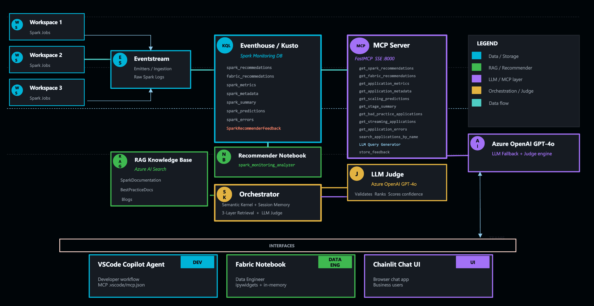

# ⚡ Fabric Spark Advisor (FSA)

[](https://www.python.org/downloads/)
[](https://opensource.org/licenses/MIT)
[](https://azure.microsoft.com/en-us/products/ai-services/openai-service)
[](https://www.microsoft.com/en-us/microsoft-fabric)

AI-powered Apache Spark optimization assistant for Microsoft Fabric, powered by:
- **MCP (Model Context Protocol)** for tool integration
- **Azure OpenAI GPT-4o** for intelligent recommendations
- **Azure AI Search** for RAG documentation retrieval
- **Azure Kusto** for telemetry analysis
- **Semantic Kernel** for agent orchestration
- **Starlette + uvicorn** for the chat UI backend
- **Static HTML/JS** — Chat UI served from `ui/chat.html`

## 🎥 Demo

> **📹 [Click here to download and watch the demo video](https://github.com/anuyogamlab/Fabric-Spark-Advisor/raw/main/assets/demo.mp4)** (53MB MP4)

**Fabric Spark Advisor in action** - Analyzing Spark applications, retrieving recommendations from Kusto, and providing actionable optimization guidance through conversational AI.

**Demo Highlights:**
- 💬 Natural language queries for Spark analysis
- 📊 Real-time Kusto data retrieval and visualization
- 🤖 AI-powered recommendation validation with confidence scoring
- ✅ Interactive feedback collection
- 🎨 Professional UI with collapsible sections and rich formatting

## ✨ Key Features

- 🎯 **Evidence-First Analysis** - Kusto data always shown verbatim, never modified or re-scored
- 🔍 **SparkLens Integration** - Deep Spark execution analysis with performance metrics
- 📚 **RAG-Enhanced Context** - Official Microsoft Fabric documentation retrieval
- 🤖 **AI Judge** - GPT-4o validates and ranks recommendations with confidence scoring
- 💬 **Conversational Interface** - Natural language queries with intent detection
- 📊 **Multi-Interface Support** - Chat UI (static HTML), VS Code Copilot, Fabric Notebooks, Python API
- 🔄 **Feedback Loop** - Learn from user ratings to improve future suggestions
- ⚡ **10 MCP Tools** - Unified data access with natural language query support
- 🎨 **Professional UI** - Interactive widgets, rich formatting, clickable feedback
- 🔐 **Enterprise Ready** - Multi-auth fallback, Azure integration, secure credential handling

## 📐 Architecture



### System Components

**Data Sources:**
- **Fabric Workspaces** (1-3) → **Eventstream** → **Eventhouse/Kusto** - Ingests raw Spark logs and metrics
- **Eventhouse/Kusto** - Stores SparkLens metrics, Fabric recommendations, feedback data
- **RAG Knowledge Base** (Azure AI Search) - Microsoft Fabric Spark documentation
- **Recommender Notebook** - Generates Fabric-specific recommendations

**MCP Server Layer (10 Tools):**
- **10 MCP Tools** — Unified data access (SSE protocol, port 8000)
  - `get_application_metrics` · `get_sparklens_recommendations` · `get_fabric_recommendations`
  - `get_application_metadata` · `get_scaling_predictions` · `get_stage_summary`
  - `get_bad_practice_applications` · `get_application_summary`
  - `search_recommendations_by_category` · **`get_application_trend`** *(new)*

**Orchestration & Intelligence:**
- **Orchestrator** (Semantic Kernel) — 3-layer retrieval: Kusto → RAG → LLM
- **LLM Judge** (Azure OpenAI GPT-4o) — Validates, ranks, scores confidence

**User Interfaces:**
- **Chat UI** — Browser-based conversational interface (Starlette + static HTML, port 7432)
- **VSCode Copilot Agent** — Developer workflow integration (MCP `.vscode/mcp.json`)
- **Fabric Notebook** — Data engineer ipywidgets UI

### How a Request Flows — Two Examples

#### Example A: "analyze application_1234"  *(app analysis)*

```
You type:  "analyze application_1234"
                        │
                        ▼
          [1] Spell-check / normalize input      ← LLM call
              e.g. "aplcation" → "application"
                        │
                        ▼
          [2] Semantic Kernel reads your message
              and picks the right skill automatically
              (FunctionChoiceBehavior.Auto — no hard-coded if/else)
                        │
                        ▼  picks → analyze_app skill
          [3] Plugin skill calls MCP tools one by one  (agent/plugin.py)
              ├─ get_application_metrics   ──► Kusto query
              ├─ get_sparklens_recs        ──► Kusto query
              ├─ get_fabric_recs           ──► Kusto query
              └─ get_application_metadata  ──► Kusto query
                           │
                           │  all via SSE :8000
                           ▼
                  MCP Server (mcp_server/server.py)
                  10 Kusto-backed tools
                           │
                           ▼
                   Eventhouse / Kusto
              (sparklens_* tables · feedback)
                        │
                        ▼
          [4] LLM Judge Validates
                        │
                        ▼
          [5] Response → Chat UI
                        │
                        ▼
          [6] User rates response → saved to sparkagent_feedback
```

#### Example B: "what is VOrder?"  *(general knowledge)*

```
You type:  "what is VOrder?"
                        │
                        ▼
          [1] Spell-check / normalize input
                        │
                        ▼
          [2] Semantic Kernel picks → search_documentation skill
                        │
                        ▼
          [3] RAG search: Azure AI Search scans
              indexed Fabric Spark docs  (direct Python call, not via MCP)
              Returns top 3 matching doc excerpts
                        │
                        ▼
          [4] LLM composes answer using the doc excerpts as context
                        │
                        ▼
          [5] Response → Chat UI
```

### Target Architecture *(post-demo refactor, 5-8 days)*

```
User Query
     │
     ▼
 Intent Router ──► AdvisorContext (typed dataclass)
     │                    │
     ▼                    ▼
 Context Builder   (last_app_id, session_history, feedback_prefs)
     │
     ├──────────────────────────────────────────────────────────────────┐
     │  asyncio.gather (parallel — no data dependency)                  │
     ▼                ▼                  ▼                ▼             │
Diagnostics     Recommendations    Scaling Agent    Trend Agent        │
  Agent           Agent + RAG       (predictions)   (daily bins)       │
(metrics/meta)  (Kusto + AI Search)                                     │
     │                │                  │                │             │
     └────────────────┴──────────────────┴────────────────┘             │
                                  │                                     │
                                  ▼                                     │
                         Remediation Agent                              │
                      (Kusto + RAG config patterns)                     │
                                  │                                     │
                                  ▼                                     │
                             LLM Judge                                  │
                    (cross-source consistency check)                    │
                                  │                                     │
                                  ▼                                     │
                        Response Formatter                              │
                    (tier labels, source badges)                        │
                                  │                                     │
                                  ▼                                     │
                        Feedback Capture ◄──────────────────────────────┘
                       (sparkagent_feedback)
```

**Key Architecture Principles:**
- ✅ **Unified Data Access** - All Kusto queries flow through MCP tools (10 tools, SSE protocol)
- ℹ️ **RAG + Judge are direct calls** - Azure AI Search and LLM Judge bypass MCP SSE intentionally (in-process, lower latency)
- ✅ **Enterprise Auth** - Multi-fallback authentication across all interfaces
- 📊 **RAG Efficiency** - ~1000 token cost for documentation context justified by improved validation quality
- 💰 **ROI First** - Preventing one production incident saves far more than token costs

## 🔧 Prerequisites

**Before installing FSA, you need the Fabric Spark Monitoring infrastructure:**

### Required Infrastructure

This MCP tool **consumes** SparkLens data and recommendations. You must first set up the data pipeline using the official **Microsoft Fabric Spark Monitoring** toolkit:

🔗 **[Fabric Spark Monitoring Setup](https://github.com/microsoft/fabric-toolbox/tree/main/monitoring/fabric-spark-monitoring)**

**What this sets up:**
1. **Eventhouse/Kusto Database** - Stores SparkLens metrics, Fabric recommendations, feedback data
2. **Eventstream** - Real-time ingestion of Spark logs from Fabric Workspaces
3. **Real-Time Dashboard** - KQL-based monitoring and visualization
4. **Recommender Notebook** - Generates Fabric-specific optimization recommendations
5. **Table Schemas** - Pre-configured tables:
   - `sparklens_recommedations` (SparkLens recommendation data)
   - `fabric_recommedations` (Fabric-specific guidance)
   - `sparklens_metrics` (performance metrics)
   - `sparklens_metadata` (Spark config properties)
   - `sparklens_predictions` (scaling what-if scenarios)
   - `sparkagent_feedback` (user feedback)


### Estimated Setup Time
- **Infrastructure setup**: 5-10 minutes
- **Data ingestion**: 1-2 hours (depends on Spark job frequency)
- **FSA installation**: 10-15 minutes

Once the infrastructure is running and data is flowing, proceed with FSA installation below.

---

## 🚦 Quick Start

### 1️⃣ Install Dependencies

```bash
# Clone the repository
git clone https://github.com/anuyogamlab/Fabric-Spark-Advisor.git
cd Fabric-Spark-Advisor

# Install Python dependencies
pip install -r requirements.txt

# Or use conda
conda env create -f environment.yml
conda activate spark-recommender
```

### 2️⃣ Configure Environment

```bash
# Copy example .env file
cp .env.example .env

# Edit .env with your credentials
# Required:
#   - AZURE_OPENAI_ENDPOINT
#   - AZURE_OPENAI_API_KEY
#   - AZURE_OPENAI_DEPLOYMENT (e.g., gpt-4o)
#   - KUSTO_CLUSTER_URI
#   - KUSTO_DATABASE
#   - AZURE_SEARCH_ENDPOINT
#   - AZURE_SEARCH_KEY
#   - AZURE_SEARCH_INDEX
```

**Example .env:**
```bash
AZURE_OPENAI_ENDPOINT=https://your-resource.openai.azure.com/
AZURE_OPENAI_API_KEY=your-key-here
AZURE_OPENAI_DEPLOYMENT=gpt-4o

KUSTO_CLUSTER_URI=https://your-cluster.kusto.windows.net
KUSTO_DATABASE=SparkMonitoring

AZURE_SEARCH_ENDPOINT=https://your-search.search.windows.net
AZURE_SEARCH_KEY=your-key-here
AZURE_SEARCH_INDEX=spark-docs-index
```

### 3️⃣ Index Documentation (First Time Only)

```bash
# Index Fabric Spark documentation into Azure AI Search
python rag/indexer.py
```

This indexes 5 Microsoft Fabric Spark documentation files with category metadata.

### 4️⃣ Run the Application

```bash
# Start both MCP server and Chat UI
python run.py
```

**This starts:**
- 📡 **MCP Server** on http://127.0.0.1:8000 (SSE protocol)
- 🎨 **Chat UI** on http://localhost:7432 (Starlette + uvicorn serving `ui/chat.html`)

**Then open:** http://localhost:7432/chat.html

## 💻 Usage

### Chat UI

Open http://localhost:7432/chat.html in your browser. The interface supports natural language queries:

**Analyze a specific application:**
```
analyze application_1771438258399_0001
```

**Find problematic applications:**
```
show bad apps
show driver heavy jobs
show memory intensive apps
```

**Find healthy applications:**
```
show well optimized apps
show apps that follow best practices
```

**Ask general questions:**
```
what causes high GC overhead?
how do I fix shuffle spill?
what is VOrder in Fabric?
```

### VS Code Agent Mode (GitHub Copilot)

The MCP server can be used directly in VS Code with GitHub Copilot Chat.

**Setup:**

1. MCP configuration is already in `.vscode/settings.json`
2. Restart VS Code
3. Open Copilot Chat
4. MCP tools are automatically available

**Available MCP Tools:**

1. `get_sparklens_recommendations(application_id)` - SparkLens analysis and recommendations
2. `get_fabric_recommendations(application_id)` - Fabric-specific optimization guidance
3. `get_application_metrics(application_id)` - Performance metrics (executor efficiency, GC, skew)
4. `get_application_metadata(application_id)` - Spark configuration properties and job details
5. `get_scaling_predictions(application_id)` - What-if scaling scenarios and cost estimates
6. `get_stage_summary(application_id, stage_id)` - Stage-level performance breakdown
7. `get_bad_practice_applications(min_violations)` - Find apps with anti-patterns
8. `get_application_summary(application_id)` - Aggregated app health summary
9. `search_recommendations_by_category(category)` - Filter by memory/shuffle/join/skew categories
10. `get_application_trend(application_name, days)` - Performance trend over time

> **💡 Natural Language Queries**: The orchestrator automatically translates your questions into appropriate MCP tool calls. 

**Usage in Copilot Chat:**

```
@workspace Get Sparklens recommendations for application_12345

@workspace Find applications with at least 5 bad practices

@workspace Search for performance recommendations
```

### Python API

Use the orchestrator directly in your Python code:

```python
import asyncio
from agent.orchestrator import SparkAdvisorOrchestrator

async def main():
    orchestrator = SparkAdvisorOrchestrator()
    
    # Analyze an application
    result = await orchestrator.analyze_application("application_12345")
    print(f"Health: {result['overall_health']}")
    print(f"Recommendations: {len(result['validated_recommendations'])}")
    
    # Find bad applications
    bad_apps = orchestrator.find_bad_applications(min_violations=3)
    print(f"Found {len(bad_apps)} problematic applications")
    
    # Find driver-heavy apps
    driver_heavy = orchestrator.find_applications_by_pattern("driver_heavy")
    
    # Find healthy apps
    healthy = orchestrator.find_healthy_applications(min_score=80)

asyncio.run(main())
```

### Fabric Notebook

**Two ready-to-use notebooks for interactive Spark optimization:**

#### 🎯 Interactive UI Notebook (Recommended)
Full-featured chat interface with ipywidgets, feedback buttons, and rich formatting:

```python
# Open in Fabric: notebooks/FabricSparkAdvisor_Interactive.ipynb
# Features:
# - Interactive chat UI with back-and-forth conversations
# - Professional FSA branding and card layouts
# - Clickable feedback buttons (✅ Helpful, ❌ Not Helpful, ⚠️ Partial)
# - Real-time Kusto queries with rich visualizations
# - Session history and statistics
```

#### ⚡ Quick Start Notebook (Lightweight)
Simple function-based interface for fast queries:

```python
# Open in Fabric: notebooks/FabricSparkAdvisor_QuickStart.ipynb
# Features:
# - Lightweight, fast execution
# - Simple ask() function for queries
# - Direct Kusto query examples
# - Programmatic API access
```

**Installation in Fabric:**
1. Go to your Fabric workspace
2. Click **New** → **Import notebook**
3. Upload from `notebooks/` directory
4. Run Cell 1 to install dependencies:
   ```python
   %pip install ipywidgets pandas azure-kusto-data azure-kusto-ingest python-dotenv
   ```
5. Configure credentials (use Fabric secrets or environment variables)
6. Execute all cells to launch interactive UI

**See [notebooks/README.md](notebooks/README.md) for detailed setup instructions and examples.**

## 📦 Components

### MCP Server (`mcp_server/`)

FastMCP server exposing 10 tools for Spark analysis:
- **Port**: 8000
- **Protocol**: SSE (Server-Sent Events)
- **Tools**: 10 Kusto-backed tools
- **Config**: `.vscode/settings.json`

**Run standalone:**
```bash
python mcp_server/server.py
```

### Orchestrator (`agent/orchestrator.py`)

Semantic Kernel-based agent coordinating the full pipeline:
- Integrates MCP tools, RAG, LLM, and Judge
- 3 main methods:
  - `analyze_application(app_id)` - Full analysis pipeline
  - `find_bad_applications(min_violations)` - Find problematic apps
  - `chat(message)` - Conversational interface

### RAG System (`rag/`)

Azure AI Search-based documentation retrieval:
- **5 indexed documents** from Microsoft Learn
- **Category filtering**: performance, configuration, delta, maintenance
- **Metadata enrichment**: source URLs, categories

**Re-index:**
```bash
python rag/indexer.py
```

**Test retrieval:**
```bash
python examples/test_rag.py
```

### LLM Judge (`agent/judge.py`)

Azure OpenAI-based recommendation validator:
- **Structured output** using JSON Schema strict mode
- **Confidence scoring**: HIGH, MEDIUM, LOW
- **Contradiction detection** between recommendations
- **Priority assignment** (1-40 scale)
- **Fallback mode** when LLM unavailable

**Test judge:**
```bash
python examples/judge_demo.py
```

### UI (Chat UI + `run.py`)

Custom static HTML/JS frontend served by Starlette + uvicorn:
- **`POST /api/chat`** endpoint handled by `orchestrator.chat()`
- **Session tracking** via `session_id` in request body
- **Markdown rendering** of Kusto + LLM responses
- **Single-page app** — no build step required

## 🧪 Testing & Demos

### Run All Demos

```bash
# Test MCP tools
python examples/test_tools.py

# Test RAG retrieval
python examples/test_rag.py

# Test LLM judge
python examples/judge_demo.py

# Test orchestrator
python examples/orchestrator_demo.py
```

### Individual Tests

```bash
# Test Kusto connection and queries
python mcp_server/kusto_client.py

# Test judge with real data
python agent/judge.py

# Test RAG search
python rag/retriever.py
```

## 🐳 Docker Deployment

Build and run with Docker:

```bash
# Build image
docker build -t spark-recommender .

# Run container
docker run -p 8000:8000 -p 7432:7432 \
  --env-file .env \
  spark-recommender
```

Deploy to Azure Container Apps:

```bash
# Build and push
az acr build --registry <your-acr> \
  --image spark-recommender:latest .

# Deploy to Container Apps
az containerapp create \
  --name spark-recommender \
  --resource-group <your-rg> \
  --environment <your-env> \
  --image <your-acr>.azurecr.io/spark-recommender:latest \
  --target-port 7432 \
  --ingress external \
  --env-vars-file .env
```

## 📁 Project Structure

```
spark-recommender/
├── agent/                      # Orchestrator & Judge
│   ├── orchestrator.py        # Main orchestration agent
│   ├── judge.py               # LLM recommendation validator
│   ├── prompts.py             # System prompts
│   ├── JUDGE_README.md        # Judge documentation
│   └── ORCHESTRATOR_README.md # Orchestrator docs
├── mcp_server/                # MCP Server
│   ├── server.py              # FastMCP server (10 tools)
│   ├── kusto_client.py        # Kusto/Eventhouse client
│   └── __init__.py
├── rag/                       # RAG System
│   ├── indexer.py             # Index docs to AI Search
│   ├── retriever.py           # Search & retrieve docs
│   ├── docs/                  # Markdown documentation
│   │   ├── *.md              # 5 Fabric Spark docs
│   │   └── metadata.json     # Doc metadata
│   └── README.md
├── ui/                        # Chat UI (Starlette + static HTML)
│   ├── chat.html              # Browser frontend (single-page app)
│   ├── app.py                 # Legacy Chainlit app (unused by run.py)
│   └── README.md              # UI documentation
├── examples/                  # Demos & Tests
│   ├── test_tools.py          # Test MCP tools
│   ├── test_rag.py            # Test RAG retrieval
│   ├── judge_demo.py          # Test LLM judge
│   └── orchestrator_demo.py   # Test orchestrator
├── .vscode/
│   └── settings.json          # MCP configuration for VS Code
├── run.py                     # Main startup script
├── Dockerfile                 # Container image
├── requirements.txt           # Python dependencies
├── .env.example               # Example environment config
├── .env                       # Your credentials (gitignored)
└── README.md                  # This file
```

## 🔧 Configuration

### Environment Variables

| Variable | Description | Example |
|----------|-------------|---------|
| `AZURE_OPENAI_ENDPOINT` | Azure OpenAI endpoint | `https://your.openai.azure.com/` |
| `AZURE_OPENAI_API_KEY` | API key | `abc123...` |
| `AZURE_OPENAI_DEPLOYMENT` | Model deployment name | `gpt-4o` |
| `KUSTO_CLUSTER_URI` | Kusto cluster URL | `https://cluster.kusto.windows.net` |
| `KUSTO_DATABASE` | Database name | `SparkMonitoring` |
| `AZURE_SEARCH_ENDPOINT` | AI Search endpoint | `https://search.search.windows.net` |
| `AZURE_SEARCH_KEY` | Search API key | `xyz789...` |
| `AZURE_SEARCH_INDEX` | Index name | `spark-docs-index` |

### MCP Server Configuration

Located in `.vscode/settings.json`:

```json
{
  "mcp.servers": {
    "spark-advisor": {
      "command": "python",
      "args": ["mcp_server/server.py"],
      "type": "sse",
      "url": "http://127.0.0.1:8000"
    }
  }
}
```

## 🚨 Troubleshooting

### MCP Server won't start
- Check port 8000 is not in use
- Verify `.env` has Kusto credentials
- Test Kusto connection: `python mcp_server/kusto_client.py`

### Chat UI shows errors
- Ensure MCP server is running first
- Check port 7432 is available
- Verify Azure OpenAI credentials: `AZURE_OPENAI_*`

### RAG returns no results
- Re-index documents: `python rag/indexer.py`
- Check `AZURE_SEARCH_*` credentials
- Verify index name matches `.env`

### Judge validation fails
- Check `AZURE_OPENAI_DEPLOYMENT` exists
- Verify API version is `2024-08-01-preview` or later
- Test: `python examples/judge_demo.py`

### Authentication errors
- For Kusto: Use `az login` (Azure CLI credential as fallback)
- For OpenAI: Check API key is valid
- For Search: Regenerate admin key if needed

## 📖 Documentation

Detailed documentation for each component:

- **MCP Server**: `.vscode/settings.json` for configuration
- **Orchestrator**: `agent/ORCHESTRATOR_README.md`
- **Judge**: `agent/JUDGE_README.md`
- **RAG System**: `rag/README.md`
- **UI**: `ui/README.md`

## 🤝 Contributing

1. Fork the repository
2. Create a feature branch
3. Make your changes
4. Add tests in `examples/`
5. Submit a pull request

## 📄 License

MIT License - See LICENSE file for details

## 🙏 Acknowledgments

- **Microsoft Fabric** for Spark runtime and Eventhouse
- **Azure OpenAI** for GPT-4o LLM
- **FastMCP** for MCP server framework
- **Semantic Kernel** for agent orchestration
- **Starlette/uvicorn** for chat API backend

---

**Built with ❤️ for the Spark community**

For questions or issues, please open a GitHub issue or contact the maintainers.
